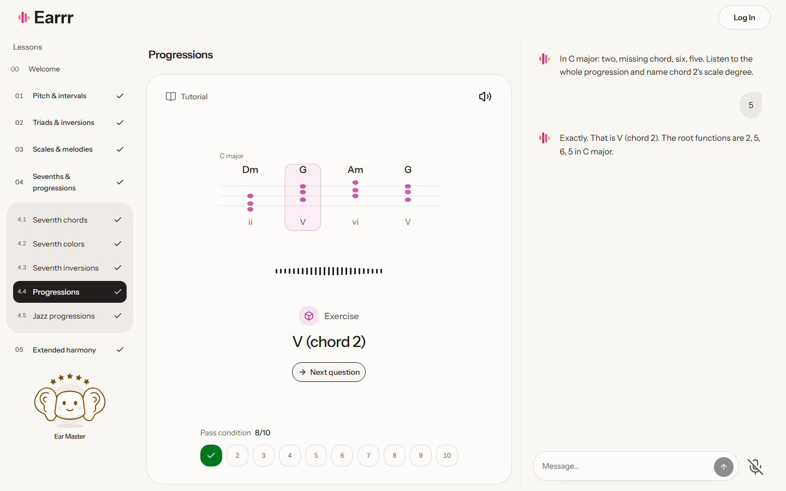
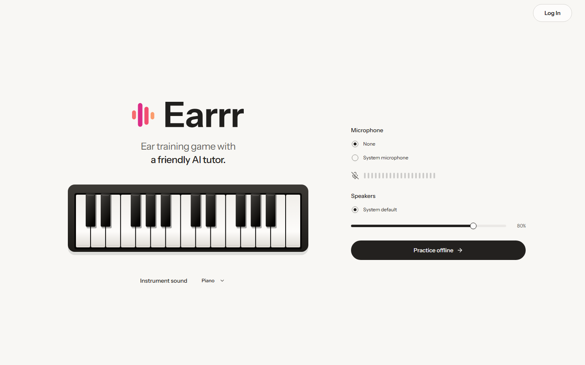

  

  <strong>Train your ears. Keep your flow.</strong> 
  A conversational ear-training game for musicians who want to practice while doing other work.

  <a href="https://earrr.app"><strong>Play Earrr →</strong></a>

## A coach, not a quiz interface

Put on headphones, start a lesson, and get back to what you were doing.
Earrr asks a question, plays the sound, and waits for your answer.

“Play that again.” “I think it’s C minor.” “Give me a hint.”

Speak naturally or type. Ask questions, repeat an example, pause, or move through
the course without memorizing commands. Desktop voice training can continue in a
background tab.

## Small rounds. Serious musicianship.

Start with pitch direction and intervals, then build toward triads, inversions,
scales, melodies, seventh chords, progressions, extended harmony and altered
dominants.

**21 lessons across five chapters.** Labeled demonstrations come before practice;
ten-question rounds have a clear **8/10** checkpoint. Repeat a round or continue
when you choose. Your ear companion grows with completed chapters, not invented
points or rushed answers.

The AI handles the conversation. A separate musical engine constructs examples,
knows the played notes, and grades the answer. Musical displays show what actually
sounded, not what the model guessed.

Listen for a missing melody note, complete a chord progression, or compare a
familiar chord with a new harmonic color. Each skill gets a fitting view:
piano keys for pitch and inversions, melodic contours, chord-function paths and
clear extension tones. The coach speaks the clues, so none of this requires
watching the screen.

## Make yourself comfortable

Choose sampled piano or acoustic guitar, set your microphone and speakers, and
practice at your own pace. Typing is always available. Repeats are free, and
silence has no deadline.

## Pick up where you left off

Try Earrr as a guest with browser-saved learning, or create an account to keep
your progress and conversation in the cloud. Lessons remember their tutorial
position and unfinished exercises, so returning does not mean starting over.

  <a href="https://earrr.app"><strong>Listen. Answer. Learn.</strong></a>

